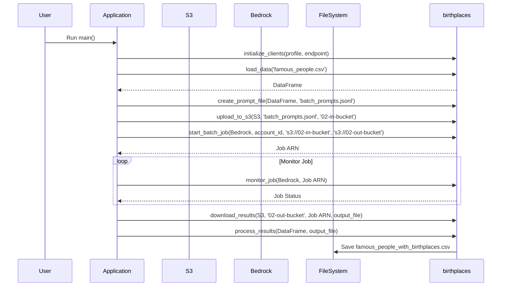

https://research-it.wharton.upenn.edu/programming/using-aws-bedrocks-batch-api/


Using AWS Bedrock’s Batch API


```shell
./setup.sh
python main.py
```
Flow


Manual test
```shell
awslocal bedrock create-model-invocation-job \
  --job-name "my-batch-job" \
  --model-id "mistral.mistral-small-2402-v1:0" \
  --role-arn "arn:aws:iam::123456789012:role/MyBatchInferenceRole" \
  --input-data-config '{"s3InputDataConfig": {"s3Uri": "s3://02-in-bucket"}}' \
  --output-data-config '{"s3OutputDataConfig": {"s3Uri": "s3://02-out-bucket"}}'

awslocal bedrock-runtime invoke-model \
--model-id "anthropic.claude-3-5-sonnet-20240620-v1:0" \
--content-type "application/json" \
--accept "application/json" \
--body 'Identify the place of birth for Marilyn Monroe. Format the result like city/country' \
--cli-binary-format raw-in-base64-out outfile.txt

awslocal bedrock-runtime converse \
    --model-id "anthropic.claude-3-5-sonnet-20240620-v1:0" \
    --messages '[{
        "role": "user",
        "content": [{
            "text": "Identify the place of birth for Marilyn Monroe. Only return: City/Country"
        }]
    }]'
```